

# Deploying to GitHub Pages {.notice-me}
**GitHub** is a platform where developers can store and manage their code in projects called **repositories**. In this guide, you will learn how to:

- Create a GitHub repository
- Upload your website files to the repository
- Publish your website using GitHub Pages
- Access and view your deployed website

!!! warning
    This guide assumes you have [created a GitHub account](https://github.com/signup) and have [logged in](https://github.com/login).

## Creating a GitHub Repository {.notice-me}
The following instructions will show you how to create a GitHub repository, to prepare to upload your website files.

**Instructions**
1. Using your web browser of choice (**Google Chrome, Microsoft Edge, FireFox**, etc..), visit [https://github.com/](https://github.com/).

2. Locate the `Create new...` button **at the top of the screen** and **click** on it

    ??? question "Preview Image - Click to view"
        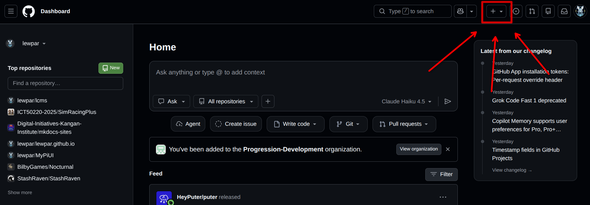

3. Select the `New repository` option from the menu that appears

    ??? question "Preview Image - Click to view"
        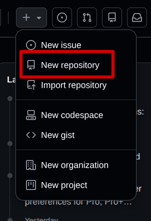

4. Fill in the repository form
You need to give your repository a name and enable the `Add README` option.

    !!! warning
        It is important that you enable the `Add README` option, otherwise you will not be able to upload files.

    ??? question "Preview Image - Click to view"
        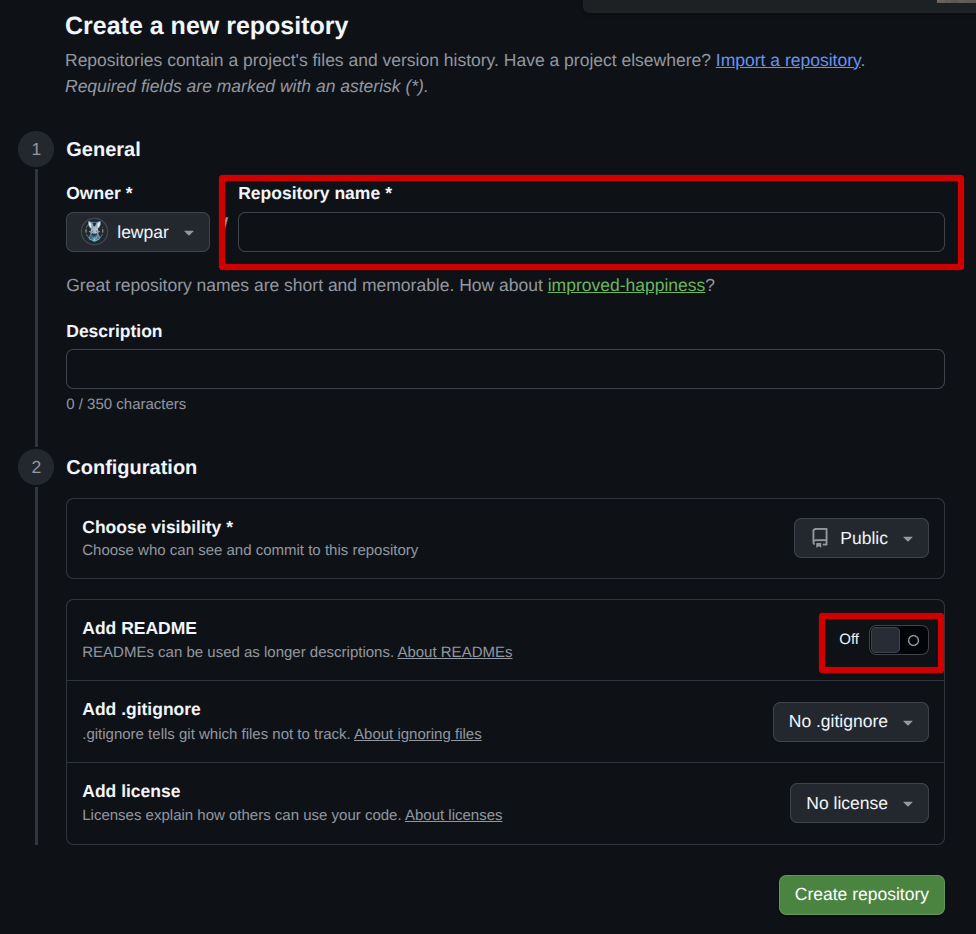

5. If you have followed these steps correctly you should see a repository with a single file in it called `README.md`:

    ??? question "Preview Image - Click to view"
        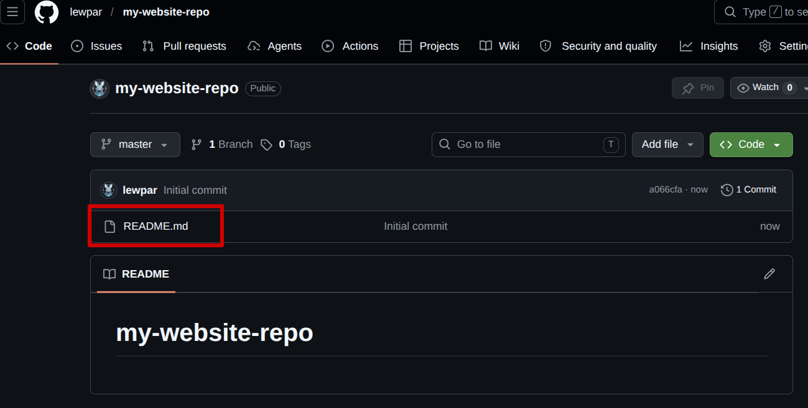

## Uploading Site Files {.notice-me}
**Instructions**

1. Click the `Add file` button

    ??? question "Preview Image - Click to view"
        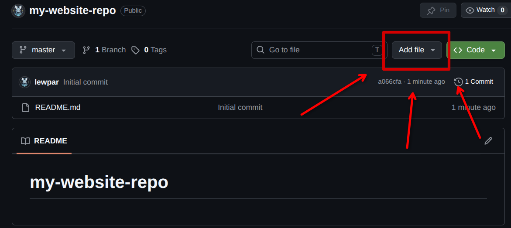

2. Select the `Upload files` option

    ??? question "Preview Image - Click to view"
        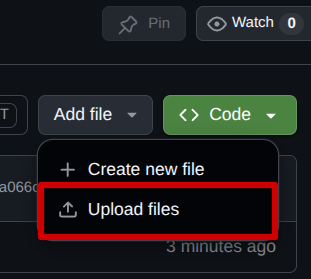

3. Click the `choose your files` link

    ??? question "Preview Image - Click to view"
        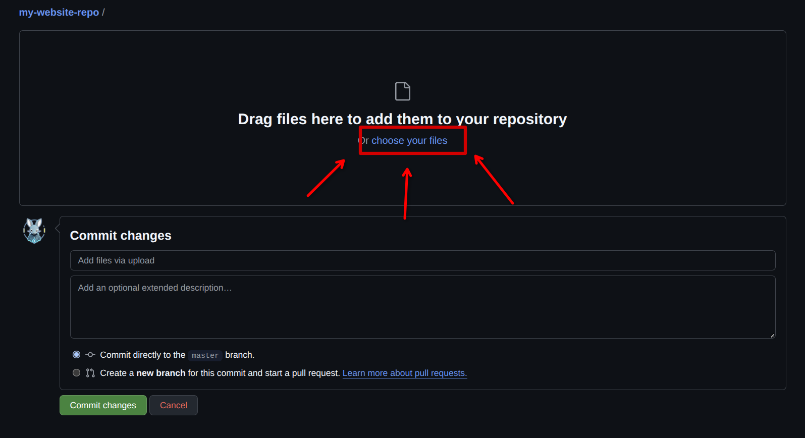

4. Select the website files you have created in a previous activity
Select any `index.html` and other `html` files you created in a previous activity and click the `open` button.
!!! This probably needs a screenshot !!!

5. Click the `Commit changes` button to upload the files

    ??? question "Preview Image - Click to view"
        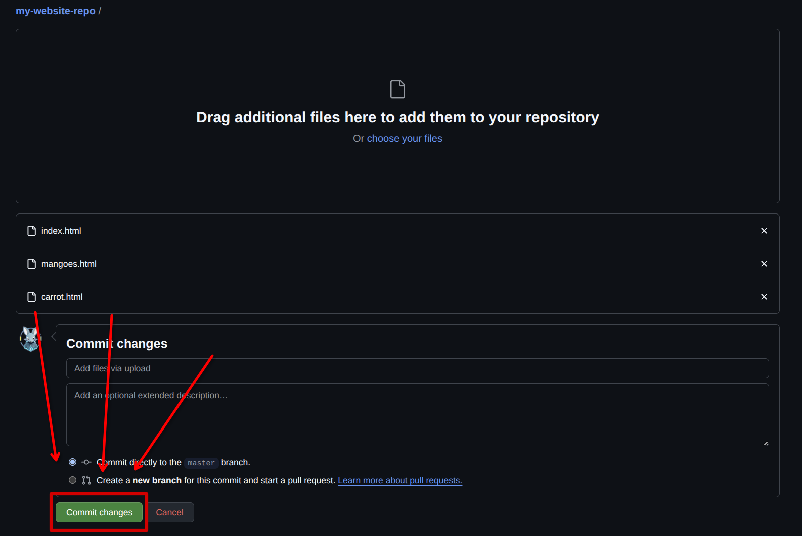

6. If you have done these steps correctly you should see your files uploaded to your repository:

    ??? question "Preview Image - Click to view"
        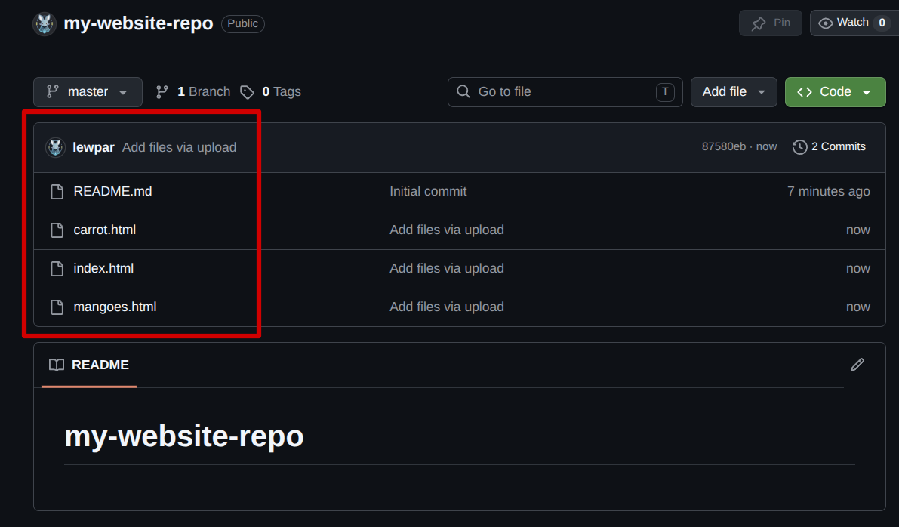

## Deploying to GitHub Pages {.notice-me}
**Instructions**

1. Click on the `Settings` tab in the navigation bar

    ??? question "Preview Image - Click to view"
        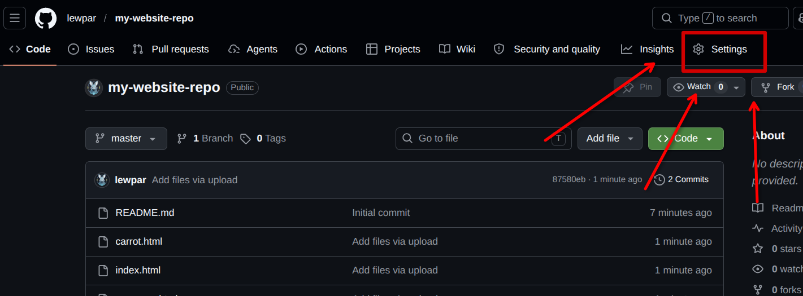

2. Click on the `Pages` tab in the sidebar navigation

    ??? question "Preview Image - Click to view"
        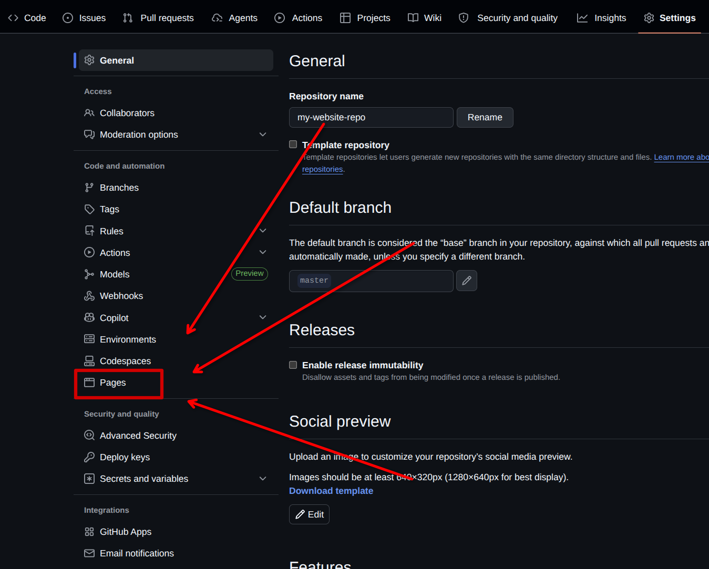

3. Click on the `Branch` drop-down menu

    ??? question "Preview Image - Click to view"
        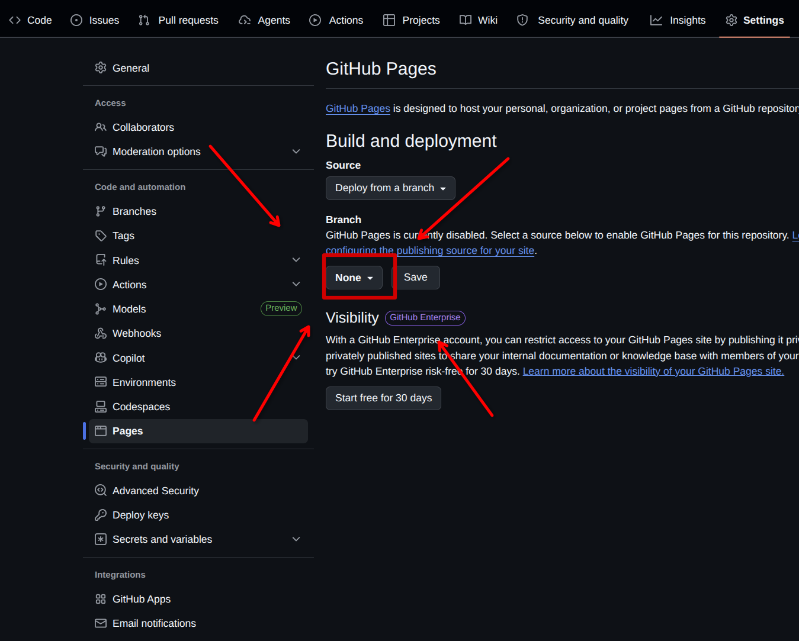

4. Select the `main` branch

    ??? question "Preview Image - Click to view"
        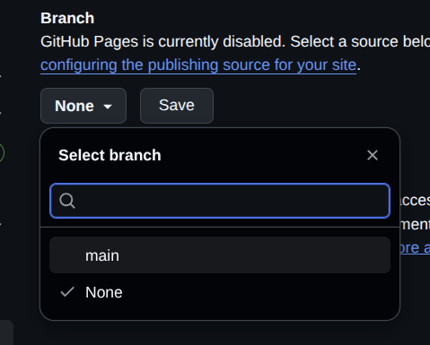

5. Click on the `Save` button

    ??? question "Preview Image - Click to view"
        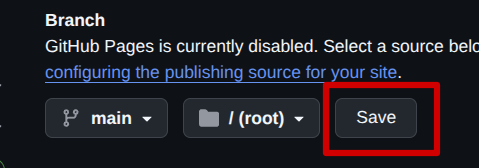

## Viewing your Deployed Website {.notice-me}
**Instructions**

1. Click on the `Actions` tab in the navigation bar

    ??? question "Preview Image - Click to view"
        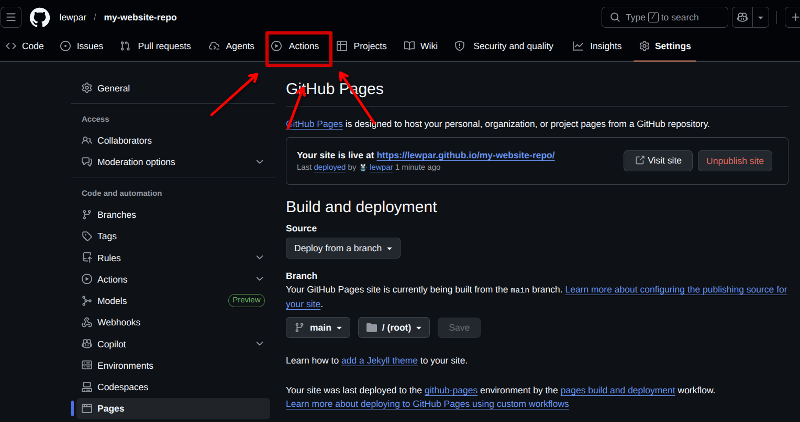

2. Wait for the action to complete
You will need to wait for the website to be deployed by GitHub, you will know when it is complete when the action changes from **orange** to **green**.

    ??? question "Preview Image - Click to view"
        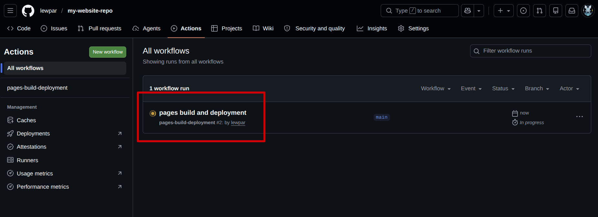

    ??? question "Preview Image - Click to view"
        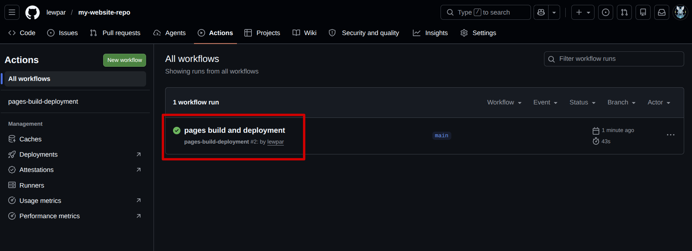

3. Click on the action name
This will take you to the completed action (the GitHub deployment)

    ??? question "Preview Image - Click to view"
        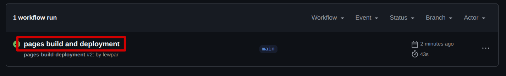

4. Click on your deployed pages link

    ??? question "Preview Image - Click to view"
        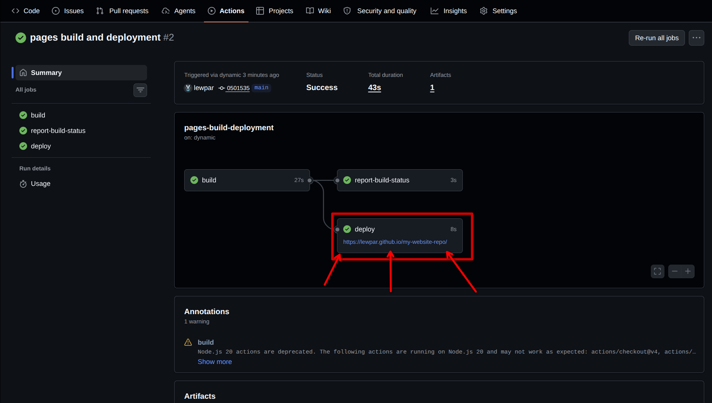

5. If you have done the steps correctly you should see the website that you made in a previous activity show up (your website may look different to mine):

    ??? question "Preview Image - Click to view"
        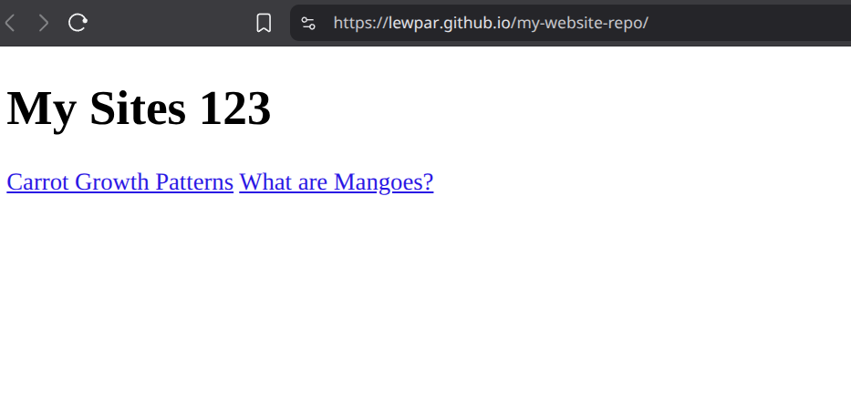

    If you do see your website then your site is now live and you can share your website link with your peers and visit it from any computer / network with an internet connection.

## Troubleshooting {.notice-me}
If you are experiencing issues with your deployed GitHub Pages website, refer to the frequently asked questions below for help:

**I only see the name of my repository with an empty site**
If your website looks like the following after deploying your site and opening the link, then you have not correctly setup your index file:

??? question "Preview Image - Click to view"
    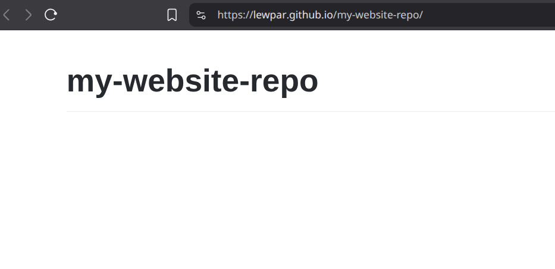

Make sure you have a `html` file in your repository named `index.html`. If you do not have this file, then the web browser does not know how to get to your page. 

Remember: Web browser look for the `index.html` file by default when you do not specify a page in the address bar.

