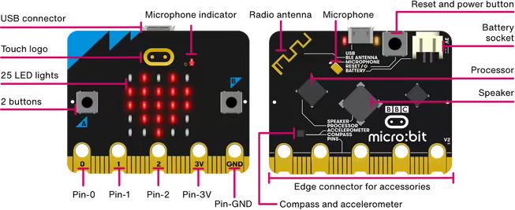
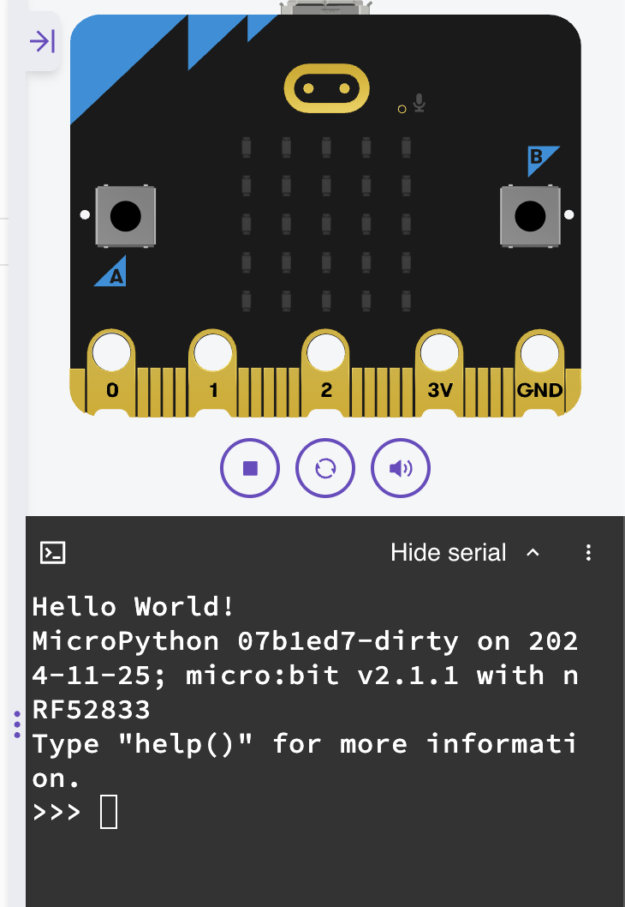

# Introduction to micro:bit with Python

## What is micro:bit?

The micro:bit is a small, programmable device that introduces learners to coding through hands-on projects. Using Python via the user-friendly python.microbit.org editor makes it ideal for beginners, as its simple interface and clear syntax help build confidence and foundational programming skills quickly.


---

## What is Python?

Python is a **high-level programming language** that is designed to be:

- Easy to read
- Simple to learn
- Powerful enough to build real applications

Python uses clear, nearly plain-English syntax, which makes it a great language for beginners.

---

## Why Use Python with the micro:bit?

We use Python to program the micro:bit because:

- **Easy to understand**  
  Python code is simple and readable, making it ideal for learning programming concepts.

- **Focus on problem-solving**  
  You can spend more time creating ideas and less time worrying about complicated syntax.

- **Works well with hardware**  
  Python lets you easily control micro:bit features like LEDs, buttons, and sensors.

- **Transferable skill**  
  Python is widely used in real-world fields such as data, web development, and automation.

---

## micro:bit online editor

We will write and test our code online using the official micro:bit Python editor:

<https://python.microbit.org/v/3>

The site has allows us to send code to our micro:bit, but we can also run our code in the built-in simulator to see how it works before sending it to the device.

The simulator is useful as it lets you:

- Write Python code
- Run your program instantly
- See virtual LEDs, buttons, and sensors in action

---

## What is a Program?

A program is a set of instructions that a computer can execute to perform a specific task. In Python, a program is typically written in a text file with a .py extension. When you run the program, the Python interpreter reads the code and executes it line by line. Generally, a program requires input, processing, and output. The input is the data that the program will work with, the processing is the logic and calculations performed on that data, and the output is the result of the program's execution.


## Variables

In Python, variables are used to store data values. A variable is essentially a name that references a specific piece of data (like a number, string, or list). You can assign a value to a variable using the assignment operator =, and then use that variable later in your code.

```python
from microbit import *

length = 10
display.scroll(length)
```

In the above code:

- Line 3 - Sets a variable named `length` to the value of `10`
- Line 4 - Scrolls the value of `length` across the micro:bit display

!!! note
    Notice in line 4 that the micro:bit displays `10` because the `length` variable was created and set to `10` previously.

## Setting values to variables

Setting values to variables is a fundamental part of programming in Python. You use the assignment operator `=` to give a variable a value. Recalling the value only requires you to use the name of the variable.

You can set multiple variables and use them to set up other variables.

```python
from microbit import *

length_1 = 12
length_2 = 3
length_3 = length_1 + length_2
display.scroll(length_3)
```

In the above we now have three variables. `length_1` and `length_2` are set to `12` and `3` respectively. `length_3` is the sum of `length_1` and `length_2`.

*Based on line 6, what number will the micro:bit display?*

Variables can be called multiple times:

```python
from microbit import *

length_1 = 12
length_2 = 3
length_3 = length_1 + length_2

display.scroll(length_1)
sleep(length_2 * 1000)
display.scroll(length_2)
sleep(length_2 * 1000)
display.scroll(length_3)
```

This time the micro:bit scrolls three separate numbers across the display. Notice that we make the micro:bit wait in between each scroll using `sleep()`. `sleep()` takes a value in **milliseconds**, so we multiply `length_2` by `1000` to convert seconds to milliseconds.

*How long is the micro:bit waiting after each scroll?*

We can make the micro:bit do a little display animation:

```python
from microbit import *

left_image = Image.ARROW_W
right_image = Image.ARROW_E
wait_time = 2000

display.show(left_image)
sleep(wait_time)
display.show(right_image)
sleep(wait_time)
display.show(left_image)
sleep(wait_time)
display.show(right_image)
```

!!! note
    We've changed the names of the variables to `left_image`, `right_image`, and `wait_time`. It's important and useful to name variables with names that are descriptive.

Line 11 shows the `left_image` arrow again, and line 13 shows the `right_image` arrow again. Notice that `wait_time` is used throughout to keep the timing consistent — changing it in one place (line 5) changes the timing everywhere. Why is that useful?

## print()

print() is a built-in function that outputs text to the console. It is commonly used for debugging and displaying information while developing code.
You can view the result of the print() function by opening the serial part of the micro:bit editor.


```python
from microbit import *

name = "Santa Claus"

print("Hello World!")
print("Good bye")
print(name)
```

## Class Activity

Add more to the display animation above by adding up and down arrows.  See the micro:bit documentation at <https://python.microbit.org/v/3/api/microbit.Image> or just experiment!
