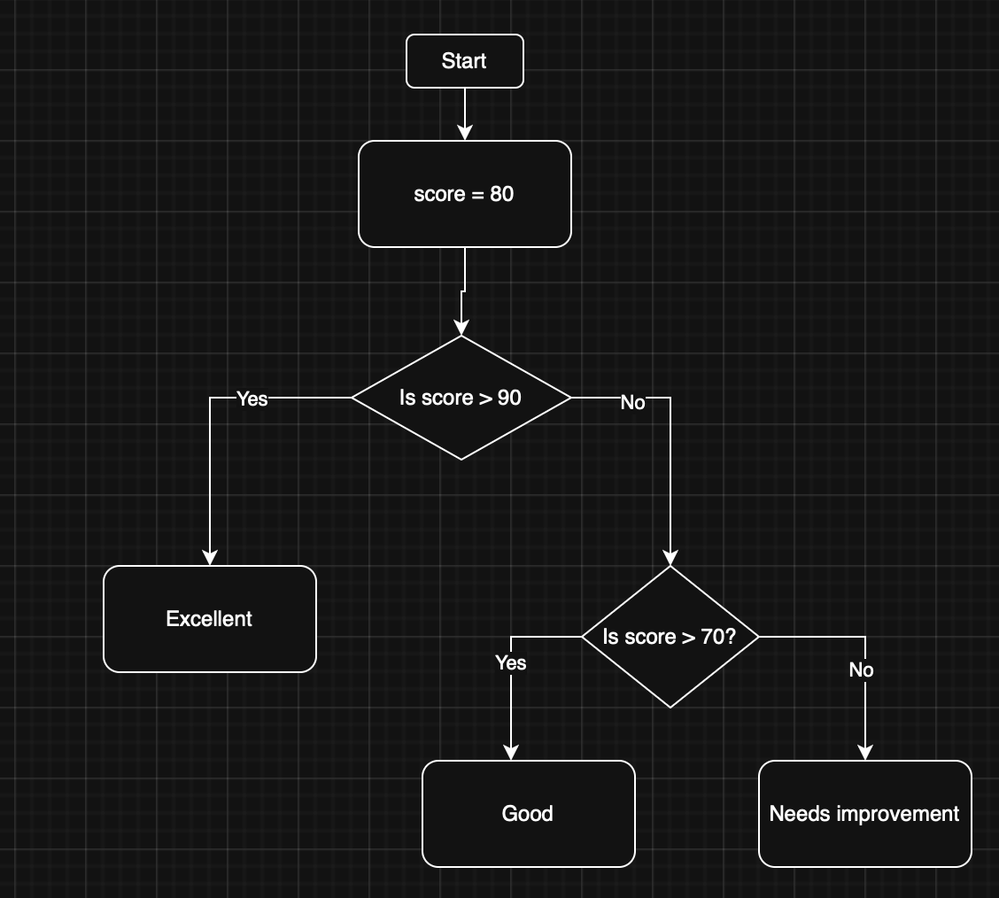

# Selection - if / else / elif (micro:bit)

## What is Selection?

**Selection** is a programming concept where the program chooses different paths of execution based on whether a condition is `True` or `False`.

{ width=256 }

All choices are made via a decision based on a **condition**. A **condition** is a statement that can be either **True** or **False**. It’s used in programming to decide whether a certain block of code should run.

For example, in the above flowchart, the condition is _if Age is greater or equal to 18_. This evaluates as either true or false and the program will execute accordingly. Notice that _Age_ is a variable that can be any value.

There are other comparisons that can be made:

| Operator | Meaning         | Example   |
|----------|----------------|-----------|
| ==       | Equal to       | x == 5    |
| !=       | Not equal to   | x != 5    |
| >        | Greater than   | x > 5     |
| <        | Less than      | x < 5     |
| >=       | Greater or eq. | x >= 5    |
| <=       | Less or equal  | x <= 5    |

---

## Selection - If

In Python, this decision is represented by the keyword **if**.

Let's look at how this works with the micro:bit:

```python
from microbit import *
import music

beep_twice = True
beep_thrice = False

if beep_twice == True:
    music.pitch(880, 200)
    sleep(200)
    music.pitch(880, 200)
    sleep(200)

if beep_thrice == True:
    music.pitch(988, 200)
    sleep(200)
    music.pitch(988, 200)
    sleep(200)
    music.pitch(988, 200)
    sleep(200)
```

- If `beep_twice` is `True`, the micro:bit will beep twice.
- If `beep_thrice` is `True`, it will beep three times.
!!! note
    In this example, only the first block of code will run because `beep_twice` is `True` and `beep_thrice` is `False`.

Try changing the values of `beep_twice` and `beep_thrice` to see what happens.

---

## Selection - Else

{ width=256 }

What if we want to do something on the `False` side of the decision? For this, we use the keyword `else`:

```python
from microbit import *
import music

beep_twice = False

if beep_twice == True:
    music.pitch(880, 200)
    sleep(200)
    music.pitch(880, 200)
    sleep(200)
else:
    music.pitch(988, 200)
    sleep(200)
    music.pitch(988, 200)
    sleep(200)
    music.pitch(988, 200)
    sleep(200)
```

- If `beep_twice` is `True`, the micro:bit shows a happy face twice.
- Otherwise, it shows a heart three times.

Only one set of code will run, depending on the condition.

Another example:

```python
from microbit import *

age = 12

if age >= 18:
    print("Adult")
    display.scroll("Adult")
else:
    print("Minor")
    display.scroll("Minor")
```

Here, the micro:bit will show "minor" because `age` is less than 18.

_What value would age need to be to show "Adult"?_

## Class Activity

Write a program that checks if a number is positive or negative. If the number is positive, it should display "Positive". If the number is negative, it should display "Negative". Try changing the number to see different results.

---

## Selection - Else If (elif)

{ width=500 }

Sometimes, we need to check multiple conditions. We can use `elif` (else if):

```python
from microbit import *

score = 85

if score > 90:
    print("Excellent")
    display.scroll("Excellent")
elif score > 70:
    print("Good")
    display.scroll("Good")
else:
    print("Needs improvement")
    display.scroll("Needs improvement")
```

- If `score` is above 90, it shows "Excellent".
- If `score` is above 70 (but not above 90), it shows "Good".
- Otherwise, it shows "Needs improvement".

Let's apply `elif` to a another example:

```python
from microbit import *

age = 16

if age >= 18:
    print("Adult")
    display.scroll("Adult")
elif age >= 16:
    print("Almost!")
    display.scroll("Almost!")
else:
    print("Young")
    display.scroll("Young")
```

Which message will the micro:bit display? Try changing the value of `age` to see different results.

## Class Activity

Write a program that checks if a number is positive, negative, or zero. If the number is positive, it should display "Positive". If the number is negative, it should display "Negative". If the number is zero, it should display "Zero". Try changing the number to see different results.

---

## Inputs

Micro:bit can also take input from a keyboard.  We can do this using the `input()` function.

```python
from microbit import *

name = imput("Please enter your name")
greeting = "Hello " + name
print(greeting)
display.scroll(greeting)
```

In the above, we are storing the user's input in a variable called `name`. We then create a greeting message by concatenating "Hello " with the user's name. Finally, we print the greeting to the console and scroll it on the micro:bit display.
!!! note
    The `input()` function is a built-in function in Python that allows you to take input from the user. When the program reaches the `input()` function, it will pause and wait for the user to enter something. Once the user presses Enter, the input is stored in the variable `name`.  Of course, the variable used to store the result of input() can be called whatever name you would like.

Let's update the Age program from above to incorporate user input:

```python
from microbit import *

age = int(input("Please enter your age: "))

if age >= 18:
    print("Adult")
    display.scroll("Adult")
elif age >= 16:
    print("Almost!")
    display.scroll("Almost!")
else:
    print("Young")
    display.scroll("Young")
```

Now all of a sudden our program is much more interactive!
!!! note
    Notice that we used `int(input(...))` to convert the user's input from a string to an integer. This is necessary because the `input()` function returns a string, and we need to compare it to numbers in our conditions.  For more inforamation on this see <https://www.geeksforgeeks.org/python/convert-string-to-integer-in-python/> or ask your friendly LLM "can you explain Python datatypes and casting to me?"

## Class Activity

Write a program that takes an input `name`.  
If `name` is `Mohammed` print and display "Teach me IoT".  
If `name` is `Lewis` print and display "Teach me web".  
If `name` is `Anh` print and display "Don't teach me Cyber".  
Otherwise, for any other name print and display "Hello [name]"
