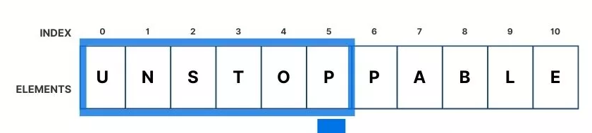

# Lists in MicroPython

## Introduction

Lists are a fundamental data structure in Python and MicroPython. They allow you to store multiple items in a single variable and are very useful for managing collections of data.

An example of when a list may be useful is when you want to store a series of sensor readings or names.  We could try to create the required number of variables to store each reading but we often do not know how many readings we need to store.  Even if we we did it would be inefficient and difficult to manage the hundreds and/or thousands of variables required.

Instead, we can use a **list** to store all the readings in one variable.  It is common to visualise a list as a row of boxes, where each box can hold a value.  The boxes are numbered starting from 0, so the first box is box 0, the second box is box 1, and so on.  This numbering is called **indexing**.



In the above example:

- we can see that the list is of **size** 11.  
- It's indexes go from 0 to 10.  
- At index 0 is the element "U".  At index 5 is the element "P".

## Creating Lists

You can create a list by placing items inside square brackets, separated by commas. For example:

```python
numbers = [1, 2, 3, 4, 5]
words = ["micro:bit", "python", "code"]
```

In the above code we have created two lists.  On named *numbers* and one named *words*.  Notice that the lists are named just like a variable.  We can call the lists as we would a variable.

## Calling lists and accessing elements

We can call a list by using its name.  We can access elements by using the index number in square brackets.  For example:

```python
numbers = [10, 20, 30, 40, 50]
numbers[0]  # This will return 10
numbers[2]  # This will return 30
numbers[4]  # This will return 50
```

we can also reassign values in a list by using the index number.  For example:

```python
numbers = ["one", "two", "three", "four", "five"]
numbers[1] = ["twenty-five"]  # This will change the list to ["one", "twenty-five", "three", "four", "five"]
```

!!!note
    Being able to store more than one value in a list keeps our code efficient and easy to manage.  We can store as many values as we like in a list and we can access them using their index number.

## List functions

On eof the major advantages of using a list is that they are *dynamic*.  This means that the list can increase (and decrease) in size as required.
Lists also come with functions to enable this.

- `append(item)`: Adds an item to the end of the list.
- `remove(item)`: Removes the first occurrence of the item.
- `insert(index, item)`: Inserts an item at a specific position.
- `pop(index)`: Removes and returns the item at the given position (default is last item).

For example, the *append()* function can be used to add temperature sensor readings to a list as they are taken.

```python
from microbit import *

temperatures = []

for i in range(0, 5):
    temp = temperature()
    temperatures.append(temp)
    sleep(500)

print(temperatures)
```

Another useful function is *len()*, which returns the number of items in the list.  

- `len(list)`: Returns the number of items in the list.

This can be used to find out how many readings we have taken.
Example:

```python
from microbit import *

temperatures = []

temp = temperature()

while temp < 25:
    temperatures.append(temp)
    sleep(1000)

print("Number of reading before temperature reached 25 degrees: " + len(temperatures))
```

## Lists and loops

Lists and loops often go hand in hand.  We can use loops to iterate through the items in a list.  For example:

```python
from microbit import *

temperatures = []

temp = temperature()

while temp < 25:
    temperatures.append(temp)
    sleep(1000)
    temp = temperature()

for i in range(0, len(temperatures)):
    message = str((i+1)) + ":" + str(temperatures[i])
    print(message)
               
```

## Class Activities

- Create a list of your favorite micro:bit projects.
- Write code to add a new project to your list.
- Remove a project from your list.
- Print all projects in your list.

## Summary

Lists are powerful tools for storing and managing groups of data. Practice using lists to become more comfortable with them in your micro:bit projects.
