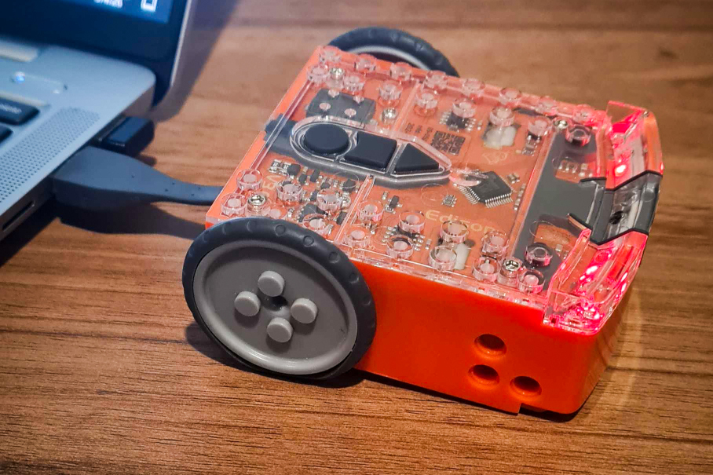
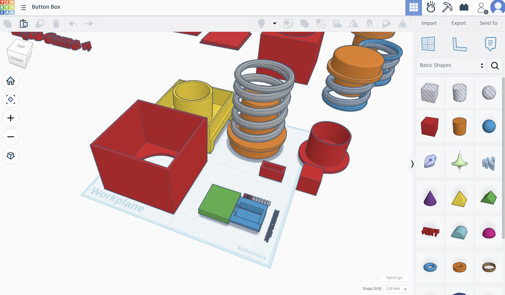
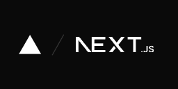

---
hide:
    - navigation
    - toc
---

# Digital Initiatives Portal

Welcome to the Digital Initiatives portal. Click on any of the cards below to open a site and bookmark this page for easy access to these pages.

New pages will appear here as they become available.

## Sites

### Certificate III

    <a class="grid-item" href="https://bki-di-python-edison.netlify.app">
        

            
        

        

            <h2>Python - Edison</h2>
            
Introduction to Python programming through structured, hands-on activities using the Edison robot.

        

    </a>

    <a class="grid-item" href="https://bki-di-design-thinking.netlify.app">
        

            
        

        

            <h2>Design Thinking</h2>
            
Explore human-centered design principles, ideation, techniques, and the end-to-end design process.

        

    </a>

### Diploma

    <a class="grid-item" href="#">
        

            
        

        

            <h2>NextJS</h2>
            
Explore Next.js - a React framework for building fast, modern web apps, through guided examples and interactive activities.

        

    </a>

