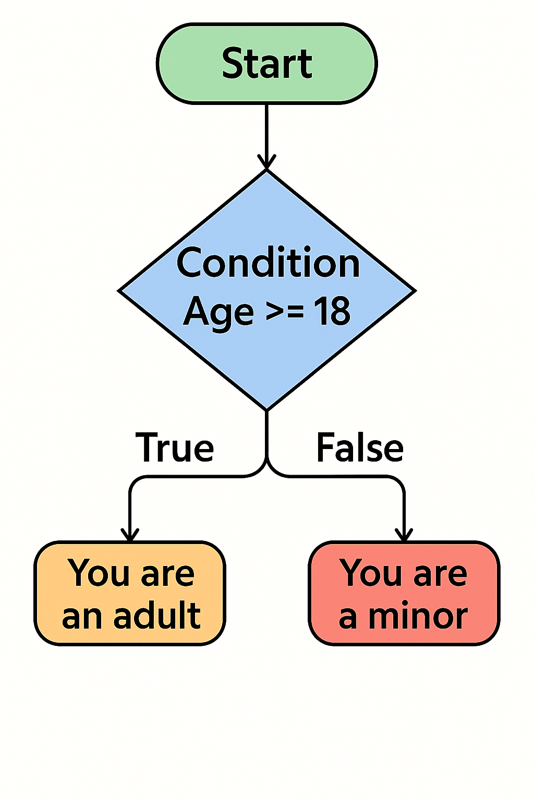

# Selection - if / else / elif

## What is Selection?
**Selection** is a programming concept where the program chooses different paths of execution based on whether a condition is `true` or `false`.

{ width=256 }

All choices are made via a decision based on a **condition**. A **condition** is a statement that can be either **True** or **False**. It’s used in programming to decide whether a certain block of code should run.

In the above flowchart, the condition is __if Age is greater or equal to 18__. This evaluates as either true or false and the program will execute accordingly. Notice that __Age__ is a variable that can be any value.

There are other comparisons that can be made:

| Operator | Meaning | Example |
| - | - | - |
| == | Equal to | x == 5 |
| != | Not equal to | x != 5 |
| > | Greater than | x > 5 |
| < | Less than | x < 5 |
| >= | Greater or equal | x >= 5 |
| <= | Less or equal | x <= 5 |

## Selection - If
In most programming languages, this decision is represented by the keyword __**if**__.

Let's look at how this works with the Edison:

```py
#-------------Setup----------------

import Ed

Ed.EdisonVersion = Ed.V3

Ed.DistanceUnits = Ed.CM
Ed.Tempo = Ed.TEMPO_MEDIUM
#--------Your code below-----------

beep_twice = True
beep_thrice = False

if beep_twice == True:
    Ed.PlayBeep()
    Ed.TimeWait(500, Ed.TIME_MILLISECONDS)
    Ed.PlayBeep()
    Ed.TimeWait(500, Ed.TIME_MILLISECONDS)
    

if beep_thrice == True:
    Ed.PlayBeep()
    Ed.TimeWait(500, Ed.TIME_MILLISECONDS)
    Ed.PlayBeep()
    Ed.TimeWait(500, Ed.TIME_MILLISECONDS)
    Ed.PlayBeep()
    Ed.TimeWait(500, Ed.TIME_MILLISECONDS)
```

We can see here that two condition are being processed (`lines 14` and `21`). The Edison will only beep twice because we have set the `beep_twice` variable to `True` (`line 11`). This makes the selection statement on `line 14` evaluate to `true` and therefore the indented code under it (`lines 15-18`) execute.

On the other hand, the variable `beep_thrice` is set to `False`, this makes the selection statement at `line 21` evaluate to `False`. therefore, the code from `lines 22` to `27` do not execute.

Notice that the syntax is similar to the event loop. There is a colon ( `:` ) at the end of the line. Code to be executed if the statement is `true` is indented, just like the event loop.

- What happens if you change `beep_twice` to `False`?
- What happens if make both `beep_twice` and `beep_thrice` to `True`?

## Selection - Else

{ width=256 }

What if we want to do something on the `False` side of the decision?

For this we have the keyword else:

```py
#-------------Setup----------------

import Ed

Ed.EdisonVersion = Ed.V3

Ed.DistanceUnits = Ed.CM
Ed.Tempo = Ed.TEMPO_MEDIUM
#--------Your code below-----------

beep_twice = False

if beep_twice == True:
    Ed.PlayBeep()
    Ed.TimeWait(500, Ed.TIME_MILLISECONDS)
    Ed.PlayBeep()
    Ed.TimeWait(500, Ed.TIME_MILLISECONDS)
else:
    Ed.PlayBeep()
    Ed.TimeWait(500, Ed.TIME_MILLISECONDS)
    Ed.PlayBeep()
    Ed.TimeWait(500, Ed.TIME_MILLISECONDS)
    Ed.PlayBeep()
    Ed.TimeWait(500, Ed.TIME_MILLISECONDS)
```

This will make the Edison beep three times.

On `line 18` we have an `else` statement which runs code to make the Edison beep three times. This happens because at `line 13` the `if` statement evaluates to `false`. The program then goes to the `else` statement at `line 18` and executes the code there. 

If we change `beep_twice` to `True` we'll have the opposite happen. Notice that only one set of code can be executed just like in the flowchart, where it's either doing things based on the `true` or `false` side of the decision.

```py
#-------------Setup----------------

import Ed

Ed.EdisonVersion = Ed.V3

Ed.DistanceUnits = Ed.CM
Ed.Tempo = Ed.TEMPO_MEDIUM
#--------Your code below-----------

age = 12

if age >= 18:
    Ed.Drive(Ed.FORWARD, Ed.SPEED_5, 10)
else:
    Ed.PlayBeep()
```

Here the Edison will beep and not drive.  

Based on the code above can the Edison ever beep and drive at the same time?

## Selection - Else If (elif)

{ width=500 }

The above is a common situation that we need to represent. We can do this in two ways. The first is by nesting if statements.

```py
if score > 90:
  print("Excellent")
else:
  if score > 70:
    print("Good")
  else:
    print("Needs improvement")
```

This is simply an `if-else` structure inside of an `if` structure and works fine. However, it can become difficult to read if we keep nesting. Also, we may run into difficulties keeping indentation correct.

We'll concentrate on using the `elif` (else if) statement to make things cleaner. The above can be written as:

```py
if score > 90:
  print("Excellent")
elif score > 70:
  print("Good"
else:
  print("Needs improvement")
```

Same logic, much easier to read (and thus maintain).

Let's apply `elif` to our Edison:

```py
#-------------Setup----------------

import Ed

Ed.EdisonVersion = Ed.V3

Ed.DistanceUnits = Ed.CM
Ed.Tempo = Ed.TEMPO_MEDIUM
#--------Your code below-----------

age = 16

if age >= 18:
    Ed.Drive(Ed.FORWARD, Ed.SPEED_10, 10)
elif age >= 16:
    Ed.Drive(Ed.FORWARD, Ed.SPEED_3, 10)
else:
    Ed.PlayBeep()
```

Which action will the Edison perform?

We need to be careful with the order in which our conditions are placed. Swap the conditions on `line 13` and `15`. What happens?
